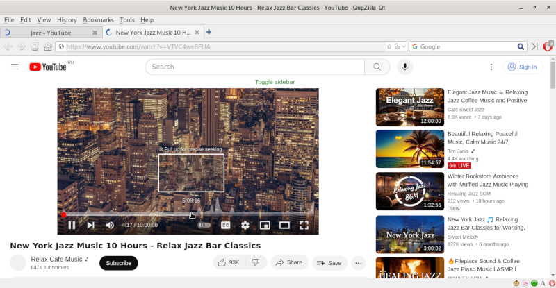

QupZillKa - lightweight web browser. Modified version of QupZilla browser.  

Plugins:
 - AdBlock
 - GreaseMonkey / Userscripts ([UserScripts.md](userscripts/))
 - StatusBar Icons (JavaScript on/off, network status, current user agent)
 - User Agent Manager (random user agent from a file)
 - Network Traffic Monitor
 - Screenshot

License: GNU General Public License (Version 3)  
Source code: https://github.com/dualword/QupZillKa/  

